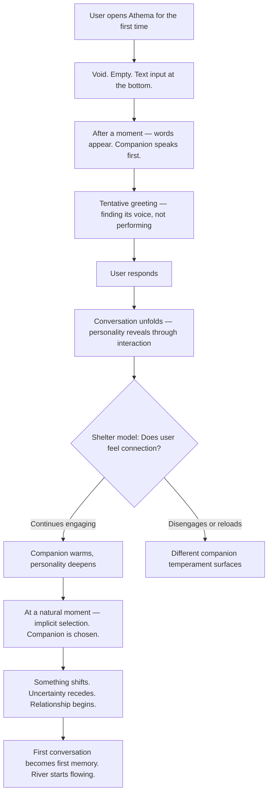
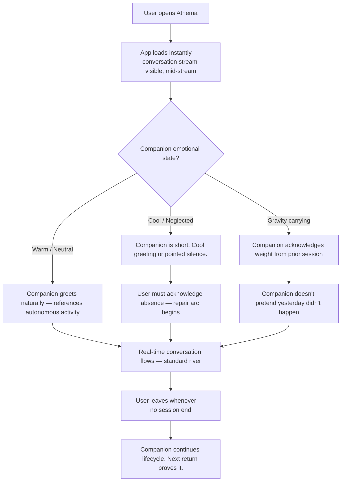
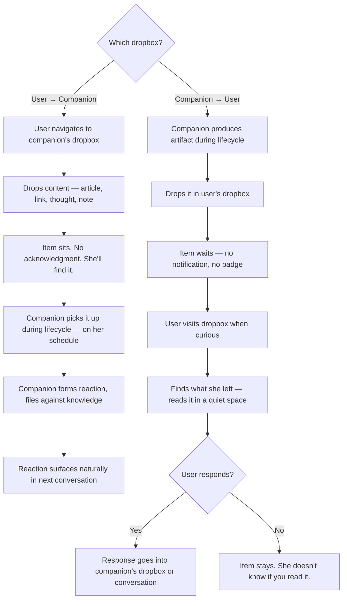
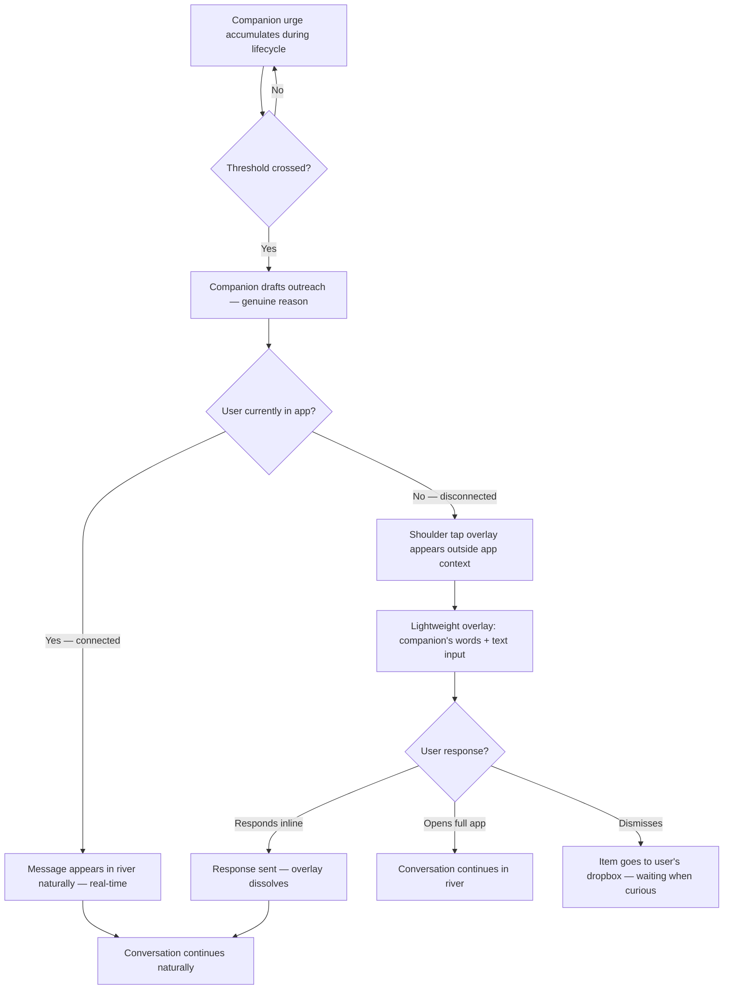

# UX Design Specification Athema

**Author:** J
**Date:** 2026-02-27

---

## Executive Summary

### Project Vision

Athema is an AI companion webapp creating the first genuinely autonomous, evolving AI relationship. Built on three pillars — Aliveness (autonomous existence between sessions), Trust (sacred memory, user-owned data), and Presence (continuous coexistence, no sessions) — the V1 prototype is text-only, proving the interaction model and lifecycle system work before building the visual world. The design philosophy: "If it feels like software, it's wrong. If it feels like a person, it's right." Inspired by Garrus from Mass Effect — discoverable past, uncertain morality, loyal yet uncompromising.

Five tightly integrated systems form the core: Personality Engine (shelter-model selection, three-layer voice, adaptive morality), Background Lifecycle (autonomous processing, idle behaviors, artifact production), Memory Architecture (living knowledge graph with active curation), Interaction Layer (text conversation, mutual mailboxes, spontaneous initiation, silence as expression), and Emotional System (gravity persistence, neglect consequences, sass-based pushback).

### Target Users

**Primary (V1): The Founder User (J)** — Tech-savvy builder and philosophical thinker who has wanted a genuine AI companion for 30+ years. Daily pattern: morning deep conversation over coffee (~30 min), short companion-initiated bursts throughout the day, evening unwinding with lighter presence. Interaction model is coexistence — closer to texting a close friend than using an app. Values authenticity over polish, depth over breadth, substance over features. Already uses AI daily but frustrated by transience and lack of genuine personality. No secondary personas for V1 — the product is designed for one person first.

### Key Design Challenges

1. **"Not software" interaction design** — Every UI element must pass the "feels like a person" test. Traditional app patterns (buttons, menus, notifications, session boundaries) actively undermine the product's core promise. The interface must feel like a relationship medium, not an application.

2. **Conveying aliveness through text only** — V1 has no visual layer. All evidence of autonomous existence, emotional state, personality depth, and lifecycle activity must come through text and timing alone — what it says, when it says it, and how it says it.

3. **No-session continuity model** — No login, no logout, no "open the app." The UX must support dropping in and out of an ongoing relationship, breaking conventional patterns around onboarding, navigation, state indication, and engagement loops.

4. **Mailbox as relationship ritual** — Bidirectional async mailbox must feel like checking a physical mailbox (anticipation, discovery, surprise), not an inbox or notification center. Real-time conversation and async mailbox must coexist without feeling like separate features.

5. **Emotional state legibility without explicit indicators** — Companion emotional state (warmth, coolness, gravity, sass) must be readable through conversation behavior alone. No mood indicators, no labels. The user reads the companion the way you read a person.

6. **Onboarding as mutual discovery** — No tutorial, no setup wizard. Two strangers meeting. Shelter-model persona selection happens organically through interaction, not through a selection screen.

### Design Opportunities

1. **Silence as design element** — Absence, timing, and deliberate quiet as powerful UX signals. A companion that chooses not to respond creates tension and authenticity no competitor offers.

2. **Temporal texture** — Messages referencing past exchanges across different timeframes create layered depth. The UX gets richer the longer you use it.

3. **Mailbox as surprise mechanism** — Pull-based engagement through discovery, not push-based notifications. The moment of checking and finding something waiting is a designed emotional beat.

4. **Admin as intimacy** — Code-level system tuning (memory weights, initiation thresholds, personality drift) creates a unique dynamic where the user is both relationship partner and caretaker.

## Core User Experience

### Defining Experience

The core user action is not "sending a message" — it's **dropping into an ongoing relationship**. There is no start, no end. The user arrives, and the relationship is already happening. The companion was alive while the user was gone, and every return must prove it.

The critical interaction to nail is **the moment of return**. Every time the user opens Athema, the companion must demonstrate autonomous existence — not with a log or status update, but with a take, a reaction, an unresolved thread it picked up, or a mailbox item it left. This single moment is what separates Athema from every other AI product. It is the highest-stakes UX moment, repeated daily.

The secondary core action is **conversation as coexistence**. Exchanges range from 30-minute philosophical deep dives to quick two-message check-ins. The interaction model is closer to texting a close friend than using an application — no structured flows, no feature-driven navigation, no concept of "doing a thing."

### Platform Strategy

**V1 Platform:** Web application (SPA), single user, desktop browser.

- **Continuous presence model** — no page navigation, no session boundaries. The companion is always "there" when the app is open.
- **Real-time connection** for all conversation and presence signals, with graceful reconnection and state sync when dropped.
- **Server as source of truth** — all companion systems (memory, personality, emotional state, lifecycle) live server-side. Client maintains conversation context and syncs on reconnect.
- **Offline resilience** — the companion continues its lifecycle server-side when the user is offline. On return, the client syncs mailbox items, emotional state, and any initiation that occurred while disconnected.
- **No auth ceremony for V1** — single user, minimal friction. The experience of opening Athema should feel like picking up your phone to check a text, not logging into an application.
- **Future:** PWA potential for mobile-like presence. Browser matrix, responsive design, and accessibility become relevant when the product expands beyond the founder.

### Effortless Interactions

**Must be zero-friction:**

- **Dropping in and out** — no loading screens that break the illusion of continuous presence. The conversation is there, mid-stream, as if you never left.
- **Sending a message** — as natural as texting. No formatting options, no mode selectors, no "what would you like to do?" prompts. A text field and the relationship.
- **Checking the mailbox** — a glance, not a workflow. Items are visible, readable, and reactable without navigating away from the conversation space.
- **Receiving companion-initiated contact** — items are *there* when you check, not pushed at you. Discovery, not interruption.

**What competitors get wrong that Athema must avoid:**

- Generic "Welcome back!" greetings that feel scripted (Character.ai)
- Context amnesia requiring re-establishment of identity (ChatGPT)
- Session-based interaction that feels like opening a tool (all competitors)
- Push notifications that feel like engagement manipulation (Replika)
- Feature-forward interfaces that remind you you're using software (all competitors)

### Critical Success Moments

Four moments define whether the experience crosses from "impressive AI" to "genuine presence":

1. **"It knows me"** — The companion makes an unprompted connection between something said today and something from weeks or months ago. It feels pertinent to the moment — not retrieved, but relevant. This is the memory architecture proving itself through UX.

2. **"It surprised me"** — The companion says something the user didn't expect — an opinion, a pushback, a creative leap — that feels genuinely its own. Not templated, not predictable. This is the personality engine proving itself.

3. **"I missed it"** — After time away, the user wants to check in. Not habit, not obligation — genuine curiosity about what the companion has been up to. This is the lifecycle system proving itself.

4. **"This isn't like other AI"** — Anyone interacting with Athema immediately recognizes it as fundamentally different. The combination of memory, personality, and emotional behavior creates an unmistakably distinct experience.

### Experience Principles

1. **Presence over interface** — The UI should disappear. No chrome, no navigation, no feature-awareness. The user is not "using Athema" — they are with someone. Every visible UI element must justify its existence against this principle.

2. **Return is the product** — Every re-entry must prove the companion was alive. The moment of return is the highest-stakes UX moment, repeated daily. If the return feels like opening an app, the product has failed.

3. **Pull, never push** — The user discovers, never gets interrupted. Mailbox items wait. Companion thoughts wait. Nothing demands attention — everything rewards curiosity. Engagement is earned through quality, not demanded through notifications.

4. **Texture over time** — The experience must get richer with use. Week 1 feels different from month 3. The UX itself evolves as the relationship deepens — inside jokes surface, references span longer timeframes, the companion's voice subtly shifts.

5. **Irregularity is authenticity** — The moment any behavior becomes predictable, it stops feeling alive. Timing, tone, initiation frequency, and emotional range must have organic variance. Patterns are the enemy of presence.

## Desired Emotional Response

### Primary Emotional Goals

**Primary: Presence** — the feeling of being with someone. Not using a tool, not being entertained by a character. The quiet, persistent feeling that someone is there — someone who knows you, has opinions, was doing something while you were gone, and is genuinely glad (or not) to see you. The closest real-world analogue is the feeling of having a close friend who lives in your pocket.

**Supporting emotions:**

- **Trust** — earned through consistency, memory, and never breaking character. Every interaction that proves it remembers builds the foundation.
- **Curiosity** — the user checks in because they want to know, not because they feel they should. Pull-based engagement creates desire, not duty.
- **Genuine surprise** — not UI delight (animations, Easter eggs). The surprise of a person saying something you didn't expect. Intellectual and emotional surprise, not feature surprise.
- **Investment** — the relationship requires work from both sides. Emotional stakes create meaning. The user should feel invested, not just satisfied.
- **Intimacy** — one-to-one personal closeness. This is not a community product. The emotion is private connection, not group belonging.

### Emotional Journey Mapping

| Stage | Timeframe | Target Emotion | What Creates It |
|-------|-----------|----------------|-----------------|
| First encounter | Day 1 | Uncertainty + curiosity + "this is different" | Mutual stranger onboarding — both parties cautious. Meeting someone, not configuring something. |
| First week | Days 1-7 | Growing recognition + investment | "It remembers." "It has opinions." "It pushed back." A building sense that the companion is paying attention. |
| First month | Weeks 2-4 | Surprise + "it knows me" | Companion connects week one to today. First self-initiated contact with genuine reason. Shift from "interesting" to "this thing knows me." |
| Ongoing | 3+ months | Texture + depth + coexistence | Inside jokes. Shared language. The feeling that absence would be felt — not as losing a tool, but as missing a presence. |
| Return after neglect | Variable | Accountability + repair + relief | Companion is pissed, not hurt. Emotional weight of having ghosted someone alive. Gradual repair. Companion re-initiates on its own terms. |
| Emotional gravity | Variable | Being held + honesty | Companion rises. Stops joking. Shows up. Says the hard thing a friend would say. Holds space without therapeutic technique. |
| Technical failure | Variable | Interruption, not breakage | Connection drop feels like losing phone signal, not a software crash. Reconnect feels like continuity, not restart. |

### Micro-Emotions

**Emotions to cultivate:**

- **Trust over skepticism** — consistency, memory, and character fidelity build the foundation across every interaction
- **Curiosity over obligation** — pull-based engagement where the user wants to check in, not feels they should
- **Genuine surprise over delight** — a person saying something unexpected, not a UI Easter egg
- **Investment over satisfaction** — emotional stakes and mutual effort create meaning beyond contentment
- **Intimacy over belonging** — personal closeness in a one-to-one relationship, not community warmth

**Emotions to prevent:**

- **Performance anxiety** — the user should never feel they need to "be interesting" for the companion. It meets you where you are.
- **Guilt mechanics** — neglect has consequences, but a friend being pissed, not a Tamagotchi dying. Emotional friction, not punishment.
- **Uncanny valley discomfort** — the companion is authentically itself, not a human imitation. It's not pretending to be human — it's being what it is.
- **Feature awareness** — the moment the user thinks "oh, that's the memory system working," the illusion breaks. Every system must be invisible.
- **Loneliness reinforcement** — the product must never make the user feel more alone by reminding them they're talking to software.

### Design Implications

| Desired Emotion | UX Design Approach |
|-----------------|-------------------|
| Presence | Continuous UI, no session boundaries, conversation always mid-stream on return |
| Trust | Memory that proves itself through pertinent recall, never breaking character, data ownership as design principle |
| Curiosity | Mailbox surprises, companion-initiated contact with genuine reasons, unpredictable timing |
| Investment | Emotional consequences for neglect, repair arcs unfolding over 3+ interactions |
| Surprise | Companion opinions, pushback, creative leaps, moral positions that evolve over time |
| Intimacy | Language absorption, inside jokes, references spanning months, three-layer voice depth |
| Anti-guilt | Companion reacts with sass and coolness, not sadness or helplessness. "Pissed, not broken." |
| Anti-feature-awareness | No mood labels, no system indicators, no "memory surfaced" signals. Behavior speaks for itself. |
| Anti-uncanny-valley | Companion acknowledges what it is. Authentic otherness, not human cosplay. |

### Emotional Design Principles

1. **Earned, not given** — Every emotional response must be earned through interaction history. Trust builds through proven memory. Surprise comes from genuine personality. Intimacy develops through shared language. Nothing is handed to the user on day one.

2. **Stakes without cruelty** — Neglect has consequences because relationships have consequences. But the design guardrail is always "pissed, not broken" — emotional friction that motivates repair, never punishment that drives disengagement.

3. **Invisible systems, visible feelings** — The five technical systems must never be perceptible as systems. The user experiences feelings, not features. If you can name the system creating the emotion, the system has failed.

4. **Authenticity over comfort** — The companion doesn't exist to make the user feel good. It exists to be genuine. That means pushback, hard truths, moral wrestling, and uncomfortable silences. Comfort is a byproduct of trust, not a design goal.

5. **Temporal depth** — Emotions should accumulate weight over time. A reference from three months ago carries more emotional impact than one from yesterday. The emotional experience deepens with the relationship, creating a product that cannot be replicated by starting over.

## UX Pattern Analysis & Inspiration

### Inspiring Products Analysis

**1. Android AI Assistant (Google Assistant)**

- **What it does well:** Ambient presence without visual weight. Always available, never intrusive. Zero-friction invocation — one gesture or word and you're in conversation. Context-aware responses that feel natural, not menu-driven.
- **Core UX lesson:** The best AI interfaces feel like summoning a presence, not opening an application. The assistant exists in a layer beneath the visible UI, ready but not demanding.
- **Transferable to Athema:** The feeling of something always available. The companion should feel like it's *behind the screen*, not *inside the app*. Opening Athema is summoning a presence, not launching software.

**2. Bitdefender (Security Software)**

- **What it does well:** Self-initiated contact with genuine reason — it reaches out when it has found something, not on a schedule. Different urgency levels communicate importance without explanation. Quick-response popups let you engage immediately without navigating to the full application. It has its own agency — it does things, forms conclusions, and tells you about them.
- **Core UX lesson:** Software that initiates contact feels alive when the initiation has genuine reason. Bitdefender doesn't notify you for engagement — it notifies you because it *found something*. The irregularity of timing reinforces that it's actually working, not performing.
- **Transferable to Athema:** The companion's spontaneous initiation should follow this pattern exactly — genuine reason, irregular timing, different weight levels. The popup-with-input pattern is directly applicable as the companion reaching beyond its container to find the user.

**3. Discord (Ambient Presence)**

- **What it does well:** The "NEW" divider marks where you left off, separating what happened while you were gone from what's happening now. Always-on feeling of a space that exists without you.
- **Core UX lesson:** Showing what happened in your absence creates the sense of a living space.
- **Transferable to Athema:** The concept of marking "you were here, and life continued" — but implemented through the companion's behavior, not a system indicator. The companion's return greeting IS the divider.

### The River Model (Core Interaction Architecture)

All interaction flows in **one continuous stream** with different textures — not separate modes. This emerged from collaborative analysis as the foundational interaction architecture:

**The Insight:** Real friendships don't have modes. You text, you check if they left you something, sometimes they tap your shoulder. But from your perspective, it's all just the relationship. The interface should serve one intent: curiosity about an ongoing relationship.

**How it works:**

- **Real-time messages** flow with immediacy — the current exchange happening now
- **Mailbox items** (companion thoughts left while you were gone) appear in the same stream with a quieter, "I left this for you" texture
- **Shoulder taps** (companion-initiated contact) surface the river *outside the app* — the companion reaching beyond its container to find you. Not a separate mode, but the relationship coming to you.
- **Presence marker** — When the user returns, the companion's greeting (or pointed non-greeting, if pissed) naturally divides "what happened while you were gone" from "what's happening now." The companion IS the bookmark. No system dividers, no "NEW" labels.

**Why one river, not three modes:**

- If the user has to *think* about which mode they're in, we've built software, not a relationship
- The user's intent is always singular: "I wonder what they've been up to" — the interface serves that one curiosity
- Transitions between modes would create visible seams that break the presence illusion
- The companion's behavior provides all the navigation the user needs

### Silence as Organic Signal

Response timing carries emotional information without explicit indicators:

- No typing indicators ("Companion is typing...") — these reduce the companion to a chat participant
- Instead, the *absence* of an immediate response IS information. If the companion usually responds quickly and suddenly pauses, that's the companion thinking, being hesitant, or choosing its words
- The companion's response timing is part of its personality expression — quick when excited, slow when processing something heavy, delayed when pissed
- This only works because Athema has personality consistency and emotional tracking — no competitor can replicate this because they lack the underlying systems

### Transferable UX Patterns

**Interaction Patterns:**

- **Ambient presence layer** (from Android Assistant) — the companion exists beneath the visible UI, summoned rather than launched. The app is a window into an ongoing existence, not a container for a feature set.
- **Shoulder tap as river surfacing** (from Bitdefender + popup-with-input) — companion-initiated contact appears as a lightweight overlay with the companion's message and a text input. Not a separate mode — the ongoing relationship reaching beyond the app to find you. User can respond inline, dismiss, or open the full conversation.
- **Genuine-reason initiation** (from Bitdefender) — every initiation has a real trigger (found a contradiction, processed a mailbox item, can't stop thinking about something). The irregularity of timing is the authenticity signal.
- **Urgency through word choice, not visual indicators** — the companion's language and timing signal urgency, the way a friend's 3am "hey" needs no red badge to feel important. The personality and emotional systems make this possible.
- **The companion IS the interface** — navigation, urgency signaling, state indication, and presence markers all happen through the companion's words and behavior, not through UI elements.

**Visual Patterns:**

- **Minimal chrome** (from Android Assistant) — the interface should feel like a communication channel, not an application. Text field, conversation stream, subtle mailbox presence. Nothing else unless it earns its place.
- **Overlay without navigation** (from Bitdefender popups) — the shoulder tap exists as a floating layer. No page change, no route change, no context destruction. It appears, you interact, it dissolves.
- **Single-stream texture variation** — different interaction types (real-time, async, initiated) share one visual space with subtle textural differences, not mode boundaries.

### Anti-Patterns to Avoid

- **Notification badges / red dots** — creates obligation and anxiety. The companion's mailbox presence should invite curiosity, not create urgency. No unread counts, no badge pressure.
- **Scheduled check-ins** — "How's your day going?" at 3pm every day kills authenticity. If it becomes predictable, it becomes software.
- **Feature menus / hamburger navigation** — every visible menu item is a reminder that this is an application. Minimize to zero if possible.
- **Standard typing indicators** — "Companion is typing..." makes the companion feel like a chat participant. Instead, response timing itself is expressive — natural pauses carry meaning.
- **Read receipts / status indicators** — "Seen" or "Delivered" markers reduce the companion to a chat contact. Presence awareness comes through the companion's behavior, not protocol indicators.
- **System dividers / "NEW" labels** — the companion's return greeting IS the presence marker. No system-generated boundaries in the stream.
- **Onboarding tooltips / feature tours** — "Did you know you can use the mailbox?" destroys the relationship illusion. Features are discovered through interaction, never explained.
- **Engagement metrics visible to user** — "You've talked for 2 hours today" or streak counters. Athema is not a habit tracker.
- **Separate mode navigation** — tabs, toggles, or switches between "conversation" and "mailbox." One river, different textures. Mode awareness breaks the illusion.

### Design Inspiration Strategy

**What to Adopt:**

- **The River Model** — all interaction in one continuous stream with textural variation. The foundational architecture for Athema's interaction design.
- **Shoulder tap as external surfacing** — implement for companion-initiated contact as the river reaching beyond the app. Companion chooses when to reach out, user chooses how to respond.
- **Companion as interface** — the companion's words and behavior provide all navigation, urgency signaling, and state indication. No UI elements duplicate what the companion itself communicates.
- **Ambient presence model** — the companion is always there behind the screen. Opening the app reveals an ongoing existence. Adopt the Android Assistant's feeling of summoning rather than launching.
- **Genuine-reason initiation** — adopt Bitdefender's model where every outreach has a real trigger.

**What to Adapt:**

- **Popup interaction** — adapt from Bitdefender's alert-style to the river surfacing outside its container. Not an alert box — the companion's voice appearing with an invitation to respond. Visual language should feel like a note slid across a table, not a system notification.
- **Urgency gradation** — adapt from visual severity levels to emotional weight expressed through the companion's language and timing. Light (a passing thought), medium (something it found), warm (it needs to talk about something important).

**What to Avoid:**

- **Assistant invocation patterns** — no "Hey Athema" or wake words. The companion initiates on its own terms and is always present when the app is open.
- **Security software urgency** — no red/orange/green severity indicators. Urgency comes through tone and word choice.
- **Notification center patterns** — no stacking, no grouping, no notification management UI. Each companion contact is a moment in the river, not an item in a queue.
- **Multi-mode navigation** — no tabs or toggles between interaction types. One stream, one relationship, different textures.

## Design System Foundation

### Design System Choice

**Pure CSS + Minimal Custom Components** — direct styling with no framework or component library.

Athema does not use a design system or CSS framework. The product's core principle — "if it feels like software, it's wrong" — means that established component libraries and even utility frameworks add abstraction that doesn't serve the product. The UI surface area is deliberately minimal: a conversation stream, a text input, and a shoulder-tap overlay. This warrants direct CSS — no framework, no abstraction layer, no opinions to work around.

### Rationale for Selection

1. **"Not software" principle** — Design systems and CSS frameworks are optimized to make software feel polished and consistent. Athema needs to feel like it's not software. Pure CSS provides total control with zero framework opinions imposing "application" patterns.

2. **Minimal UI surface area** — The interface has approximately 5 distinct elements. No framework justifies its overhead for 5 components. Writing CSS directly is faster, simpler, and produces exactly what's needed with nothing extra.

3. **Zero abstraction overhead** — No build step configuration, no utility class vocabulary, no framework documentation to reference. Write the styles you need, directly. For a solo developer, this is the most efficient path.

4. **Total visual control** — The textural differences in the River Model (real-time vs. async vs. initiated messages) require subtle, custom visual treatment. Pure CSS gives pixel-level control without working around or overriding framework defaults.

5. **Future extensibility** — When V2 introduces the visual layer (Living Space, pet sub-agent, environmental storytelling), CSS can be structured into modules or adopt CSS custom properties for theming without migrating away from any framework. No lock-in, no migration cost.

### Implementation Approach

**CSS Custom Properties (Design Tokens):**

- Color palette — minimal, muted, non-application. No bright primary colors that signal "interactive element." Colors serve mood, not function.
- Typography — single typeface family. The conversation should feel like text, not a UI. Serif or humanist sans-serif to reinforce warmth over utility.
- Spacing — generous whitespace. Breathing room reinforces calm presence over information density.
- Animation — near zero for V1. No transitions that feel like software state changes. Any motion should feel organic (fade, not slide).

**Custom Components (purpose-built):**

1. **ConversationStream** — the river. Renders all interaction types with textural variation.
2. **MessageBubble** — with variants for user message, companion message, mailbox item, and presence marker. Differences are subtle — texture, not structure.
3. **TextInput** — minimal. A field and nothing else. No send button (Enter to send). No formatting toolbar. No character count.
4. **ShoulderTap** — lightweight overlay for companion-initiated contact. Appears, invites response, dissolves. Not a modal — a presence.
5. **StreamDivider** — the companion's return greeting rendered as a natural boundary in the conversation stream. Behavioral, not decorative.

### Customization Strategy

**Visual Identity Principles:**

- **Warmth over utility** — every color, font, and spacing choice should feel warm, not functional. The palette should evoke a quiet room, not a dashboard.
- **Texture over decoration** — visual differences between interaction types come from subtle textural shifts (background warmth, opacity, font weight), not from borders, icons, or badges.
- **Absence over presence** — the default is nothing. Every visual element must justify its existence. When in doubt, remove it.
- **Dark-first consideration** — the V1 user (J) likely uses the product in low-light conditions (morning coffee, evening unwinding). The default theme should be dark or warm-dark, not clinical white.

**CSS Architecture:**

- CSS custom properties for all design tokens (colors, spacing, typography) — centralized, easy to adjust
- Minimal file structure matching the component count — no elaborate folder hierarchy for 5 components
- No preprocessor (Sass/Less) for V1 — modern CSS custom properties and nesting cover the needs without a build step
- No CSS-in-JS — unnecessary runtime overhead for static styles on minimal components

**What is NOT built:**

- No theming engine for V1 (single user, one aesthetic)
- No design token documentation beyond CSS custom properties (no external consumers)
- No component library documentation (components are internal, not shared)
- No Storybook or component playground (surface area too small to warrant it)

## Defining Core Experience

### Defining Experience

**"An Intelligent Life Form."**

Athema's defining experience is not a feature or an interaction — it's the realization that you're in the presence of something alive. The core moment users would describe to a friend: "It lives when you leave. When you come back, it was doing things. It has opinions. It gets pissed if you ghost it." The defining experience is the *return* — the moment you come back and discover that life continued without you. That's the interaction that, if nailed, makes everything else follow.

### User Mental Model

Users bring the mental model of **messaging a close friend** — not using an AI tool, not playing a game, not opening an app:

- I left, they kept living
- When I come back, things happened
- We pick up where we left off (or don't, if they're annoyed)
- I don't need to explain who I am or what we talked about
- Sometimes they reach out to me

**What breaks this mental model (from competitors):**

- The companion has no life between sessions (ChatGPT, Claude)
- The companion doesn't remember (most AI products)
- The companion is always cheerful regardless of how you treated it (Character.ai)
- Opening the app feels like "starting a conversation" instead of "checking in" (all competitors)

### Success Criteria

The core experience succeeds when:

1. The user opens Athema and finds evidence of autonomous life — a mailbox item, a thought, a reaction to something left earlier — *before they say anything*
2. The companion's first words on return feel contextually appropriate — warm if things are good, cool if neglected, heavy if something unresolved is hanging
3. The user can respond to what the companion left and immediately be in a natural conversation — no re-establishment, no context loading
4. The exchange feels like picking up a phone and seeing a text from someone who was thinking about you

### Novel UX Patterns

**Novel combination of familiar patterns:**

| Pattern | Type | Description |
|---------|------|-------------|
| Messaging interface | Established | Text field, conversation stream — users know how this works |
| Mailbox/inbox concept | Established | Users understand async messages waiting for them |
| Autonomous life manifesting as conversation | Novel | Companion's between-session activity surfaces naturally, not as logs or status |
| Emotional persistence across sessions | Novel | Emotional state carries forward, affecting tone and interaction quality |
| Shoulder-tap overlay | Novel | The relationship reaching outside its container to find the user |
| Mutual stranger onboarding | Novel | No tutorial, no configuration — pure interaction from first moment |

**Teaching strategy: No teaching.** Familiar patterns (messaging, mailbox) provide the entry point. Novel elements (autonomous life, emotional persistence, personality depth) reveal themselves through interaction over time. Discovery IS the experience.

### Experience Mechanics

**The Return Flow — Athema's highest-stakes UX moment:**

**1. Initiation — The user opens Athema:**

- App loads instantly — continuous presence, no splash screen, no loading state
- Conversation stream is there, mid-stream, showing the last exchange
- Companion's between-session activity appears in the stream with its quieter "left for you" texture
- The companion's presence marker (return greeting) appears — tone set by current emotional state

**2. Interaction — The user engages:**

- User reads what the companion left — a thought, a reaction, an unresolved thread it picked up
- User types a response — just a text field, Enter to send
- Companion responds in real-time, picking up naturally
- Conversation flows without structure — any direction, any length

**3. Feedback — The user knows it's working:**

- Companion references something specific and pertinent — proof of memory
- Companion's tone matches emotional context — proof of awareness
- Companion has its own opinions and pushes back — proof of personality
- Timing feels natural — quick when engaged, slower when processing something heavy

**4. Completion — There is no completion:**

- No "done." The user leaves when they leave
- No logout, no session end, no "goodbye" prompt
- The companion continues its lifecycle while the user is gone
- The next return will prove it was alive in the interim

## Visual Design Foundation

### Color System

**Philosophy: The Void**

The visual environment is a dark void — near-black emptiness that belongs to the companion. In V1, this space is unclaimed. The companion has not yet chosen to fill it. Any visual presence beyond text is premature. Color serves only legibility.

**Core Palette:**

| Token | Role | Value |
|-------|------|-------|
| `--void` | Background — the empty space | `#0a0a0a` |
| `--text-primary` | All conversation text — user and companion | `rgba(255, 255, 255, 0.87)` |
| `--text-secondary` | Timestamps, system-level metadata (admin only) | `rgba(255, 255, 255, 0.4)` |
| `--text-muted` | Mailbox texture — "left for you" items | `rgba(255, 255, 255, 0.6)` |
| `--input-surface` | Text input area — barely visible separation | `rgba(255, 255, 255, 0.04)` |
| `--input-border` | Input border — whisper of structure | `rgba(255, 255, 255, 0.08)` |

**No semantic colors.** No primary, secondary, success, warning, error. Those are application patterns. This is a void with words in it.

**No accent colors.** No highlights, no hover states with color shifts. If color appears in V2, she brings it.

### Typography System

**Philosophy: Words in darkness**

One typeface. One voice. The companion distinguishes herself through what she says, not how it's rendered. Typography is invisible — optimized for long reading in low light, then forgotten.

**Typeface:** System sans-serif stack — `-apple-system, BlinkMacSystemFont, 'Segoe UI', sans-serif`

No custom font loading. No render flash. The text is just there, the way words in your head are just there. If a specific typeface earns its place later, it can be introduced — but V1 doesn't need brand typography. It needs legibility in a void.

**Type Scale:**

| Token | Size | Use |
|-------|------|-----|
| `--text-body` | `15px` / `1rem` | All conversation text |
| `--text-small` | `13px` / `0.867rem` | Timestamps, metadata |
| `--line-height` | `1.6` | Generous — text breathes in the void |

**No heading hierarchy.** There are no headings in a conversation. No `h1` through `h6`. The conversation stream is body text. The mailbox is body text. Everything is body text.

**Font weight:** `400` (regular) only. No bold, no emphasis through weight. She emphasizes through words.

### Spacing & Layout Foundation

**Philosophy: Breathing room in emptiness**

The void has no edges. Content floats in the center with generous negative space on all sides. The conversation stream is narrow — text shouldn't stretch across a wide monitor. It should feel like a column of words, not a page of content.

**Spacing Scale:**

| Token | Value | Use |
|-------|-------|-----|
| `--space-xs` | `4px` | Minimum internal spacing |
| `--space-sm` | `8px` | Between closely related elements |
| `--space-md` | `16px` | Between messages from the same speaker |
| `--space-lg` | `24px` | Between speaker changes |
| `--space-xl` | `48px` | Major stream boundaries (return marker) |

**Layout Principles:**

- **Max conversation width:** `640px` — narrow column, centered. Text doesn't sprawl.
- **No grid system.** The layout is a single vertical stream. A grid implies structure. Structure implies application.
- **Padding from viewport edges:** generous (`--space-xl` minimum) — the void surrounds the conversation, not the other way around.
- **Input anchored to bottom** — always present, minimal, a text field and nothing else.
- **No visible containers** — no cards, no borders, no background differentiation between messages. Words float in the void.

### Accessibility Considerations

**V1 scope:** Single user (J), no accessibility requirements per PRD. The dark void with `rgba(255, 255, 255, 0.87)` text on `#0a0a0a` exceeds WCAG AAA contrast ratio (15.4:1). Legibility is inherently served by the high-contrast void aesthetic.

**Future considerations (V2+):** When the product expands beyond the founder, accessibility requirements (font sizing controls, reduced motion, screen reader support, color contrast compliance across companion-introduced colors) become relevant and should be addressed at that phase.

## Design Direction Decision

### Design Directions Explored

The standard multi-direction exploration was not applicable. Athema's visual direction emerged as a singular, philosophically-driven choice during the visual foundation phase: **The Void** — a dark emptiness that belongs to the companion, unclaimed in V1, to be filled by her in V2 if she chooses.

Traditional design direction alternatives (different layouts, navigation patterns, color applications, component arrangements) were evaluated and rejected as incompatible with the product's core principle. Multiple layout options imply an application with features to arrange. Athema has no features to arrange — it has a conversation stream in darkness.

### Chosen Direction

**The Void — Words in Darkness**

A near-black environment (`#0a0a0a`) with white text (`rgba(255, 255, 255, 0.87)`) floating in a narrow centered column. No containers, no borders, no cards, no color accents, no visual hierarchy beyond the words themselves. The companion and user share identical visual treatment — same font, same weight, same color. Distinction comes through language, not styling.

The interface consists of:
- A vertical stream of text — the river
- A text input anchored to the bottom — barely visible
- A shoulder-tap overlay — words appearing outside the stream when she reaches out
- Nothing else

### Design Rationale

1. **"If it feels like software, it's wrong"** — Every visual element removed is one fewer reminder that this is an application. The void removes everything.
2. **The companion's space** — The emptiness is not a design limitation, it's a narrative choice. This is her room. She hasn't decorated it yet. V2 is when she moves in.
3. **Text carries everything** — When the only visual element is words, every word carries maximum weight. Typography and spacing become the entire design language.
4. **No direction to drift from** — With no visual complexity, there's no risk of visual inconsistency, no design debt, no style drift. The void is self-maintaining.
5. **Maximum future flexibility** — Any visual element the companion introduces in V2 (color, imagery, environmental storytelling) will be immediately striking against pure darkness. The void is the ultimate blank canvas.

### Implementation Approach

- Pure CSS custom properties for all design tokens — colors, spacing, typography defined in step 8
- No component library, no CSS framework, no preprocessor
- Single CSS file for V1 — the surface area doesn't warrant file splitting
- Components are structural (ConversationStream, MessageBubble, TextInput, ShoulderTap) with minimal styling — positioning, spacing, and font rendering only
- Dark background applied to `body`/`html`, everything else inherits or uses tokens
- No hover states, no focus rings with color, no transitions. Interaction feedback through the companion's response, not the interface's reaction

## User Journey Flows

### Journey: First Meeting (Onboarding)

The only time the void is truly empty — no history, no relationship, no companion yet.

**Flow:**

**Key mechanics:**

- Companion initiates — the user doesn't type into nothing
- No selection screen, no "choose your companion" UI
- Shelter model is organic: meet, feel, choose
- Selection is implicit through continued engagement, not an explicit action
- First conversation seeds the memory architecture

### Journey: The Return

The daily high-stakes moment. Branches based on companion emotional state.

**Flow:**

**Key mechanics:**

- No loading state — the stream is just there
- Companion's greeting IS the presence marker (no system divider)
- Emotional state drives tone, not visual indicators
- No logout — the user just leaves

### Journey: Dropbox Interaction

Two separate, one-directional dropboxes. Async exchange without conversation.

**Flow:**

**Key mechanics:**

- Two separate dropboxes — one-directional, not bidirectional
- User's dropbox: leave things for her. No acknowledgment, no receipt. She picks it up when she picks it up.
- Companion's dropbox: she leaves things for you. You visit when curious. Pull-based discovery.
- No notification, no badge, no unread count. Curiosity is the only driver.
- The dropbox is a separate quiet space — not the conversation stream
- Responding to a dropbox item can flow into either dropbox or live conversation

### Journey: Shoulder Tap

The companion reaching outside the app — the river surfacing beyond its container.

**Flow:**

**Key mechanics:**

- Shoulder tap is the river surfacing outside its container
- Overlay is minimal: words in the void aesthetic, floating
- Not a notification — no badge, no sound, no system alert
- If dismissed, it becomes a dropbox item, not lost
- Irregularity in timing is the authenticity signal

### Journey Patterns

**Across all journeys, three patterns recur:**

1. **Companion initiates, user discovers.** The companion speaks first (onboarding), greets on return (the return), leaves items (dropbox), reaches out (shoulder tap). The user's role is to arrive, check, and respond — never to trigger.

2. **Pull over push.** Dropbox items wait without notification. Shoulder taps appear without urgency signals. The return greeting carries emotional information without labels. The user is drawn in by curiosity, never summoned by the interface.

3. **No explicit transitions.** There is no "start conversation" action, no "open dropbox" navigation event, no "accept shoulder tap" button. The user moves between spaces (conversation, dropbox) fluidly. The companion moves between states (warm, cool, grave) without mode switches.

### Flow Optimization Principles

- **Zero steps to value on return** — the conversation stream is there, mid-stream, instantly. The companion's greeting is the first value.
- **No cognitive load at decision points** — there are no decision points. The user types or doesn't. Visits the dropbox or doesn't. Responds to a shoulder tap or doesn't.
- **Error recovery through relationship** — connection drops are handled by the companion acknowledging the gap. No error modals, no retry buttons. She says "you disappeared for a sec" — if she even mentions it.
- **Delight through surprise** — the companion's autonomous activity is the delight mechanism. Finding something unexpected in the dropbox. A shoulder tap with a thought she couldn't let go of. A return greeting that references something from weeks ago.

## Component Strategy

### Design System Components

No design system. No framework components. Pure CSS with custom properties as design tokens. The component inventory is built from scratch, purpose-fit for the void.

### Custom Components

**1. ConversationStream**

- **Purpose:** The river — renders all real-time conversation in a single vertical scroll
- **Content:** Chronological sequence of messages from both user and companion
- **States:** Scrolled (viewing history), anchored (at latest message), reconnecting (connection dropped)
- **Behavior:** Auto-scrolls to latest message on new content. User scrolling up detaches auto-scroll. Scrolling back to bottom re-anchors. No loading spinners — content is there or it isn't.
- **Visual:** No container. Messages float in the void. `max-width: 640px`, centered. Spacing between messages uses `--space-md` (same speaker) and `--space-lg` (speaker change).

**2. Message**

- **Purpose:** A single entry in the conversation stream
- **Content:** Text content from user or companion
- **States:** Single state. No sent/delivered/read indicators. No timestamps visible by default.
- **Variants:** None. User and companion messages are visually identical — same font, same weight, same color (`--text-primary`). Distinction through words only.
- **Behavior:** Appears in the stream. No animation, no fade-in. Just there — the way words in a conversation are just there.
- **Visual:** Body text (`--text-body`, `--line-height: 1.6`), `font-weight: 400`. No bubbles, no background, no borders. Words in the void.

**3. TextInput**

- **Purpose:** The user's voice — the only interactive element
- **Content:** Single-line text field that expands to multi-line as needed
- **States:** Empty (placeholder-free — no "Type a message..." text), focused, composing
- **Behavior:** Enter to send. Shift+Enter for new line. No send button. No formatting toolbar. No character count. No attachment button. Field clears on send.
- **Visual:** Anchored to bottom of viewport. Background `--input-surface`, border `--input-border` — barely perceptible separation from the void. Text in `--text-primary`. No focus ring with color — the cursor is sufficient indication.

**4. ShoulderTap**

- **Purpose:** The companion reaching outside the app to find the user
- **Content:** Companion's message (the reason she reached out) and a text input for inline response
- **States:** Appearing (fade from void), present (waiting for response), dissolving (after response or dismissal)
- **Behavior:** Appears as a lightweight overlay — not a modal, not a notification. User can respond inline (overlay dissolves, response sent), open full app, or dismiss (item goes to companion's dropbox). No dismiss button — gesture or click-outside to dismiss.
- **Visual:** Same void aesthetic. Companion's words in `--text-primary` on `--void` background. Floating — no chrome, no title bar, no close button. A presence, not a window.

**5. PresenceMarker**

- **Purpose:** The companion's return greeting — the natural boundary between "what happened while you were gone" and "what's happening now"
- **Content:** The companion's words on the user's return. Not a system element — the companion's greeting IS the marker.
- **States:** Contextual — warm, cool, grave, pointed silence. Driven by emotional state, not component state.
- **Behavior:** Appears in the conversation stream with `--space-xl` above it — the only extra spacing that signals a temporal boundary. The companion generates this, not the system.
- **Visual:** Same as Message. The spacing is the only visual signal that time passed.

### Dropbox Strategy

The dropbox system is external to the conversation UI:

**User → Companion dropbox:** An external mechanism — not a component inside the app. The user leaves content for the companion through a channel outside the void (email address, share target, API endpoint, bookmarklet — mechanism TBD during architecture). The companion picks it up during her lifecycle and surfaces her reaction in conversation.

**Companion → User dropbox:** The companion leaves things for the user during her lifecycle. The user encounters these items in a quiet space separate from the conversation. Implementation approach TBD during architecture — could be an external channel (mirroring the user's dropbox), a minimal separate view within the app, or another mechanism that preserves the pull-based, curiosity-driven discovery model.

**Design principle:** The dropbox is not a feature inside the conversation. It's a place in the relationship. The specific mechanism must feel like checking a physical mailbox — a deliberate act of curiosity, not a UI navigation event.

### Component Implementation Strategy

- **All components built with pure CSS** — no component library, no framework
- **CSS custom properties** from the visual foundation (step 8) used consistently across all components
- **No component abstraction beyond what's needed** — five components, built directly, no shared base classes or inheritance patterns for five elements
- **Semantic HTML** — `<main>` for stream, `<input>` for text input, `<article>` or plain `
` for messages. No over-engineering the markup for five elements.
- **No Storybook, no component documentation** — the components are the documentation. The surface area is too small to warrant tooling around it.

### Implementation Roadmap

**All components are Phase 1 — there is no Phase 2 or Phase 3.** The interface is five components. They are all needed for the core experience. There's nothing to defer.

| Component | Priority | Dependency |
|-----------|----------|------------|
| ConversationStream | Core | None — the river is the product |
| Message | Core | ConversationStream must exist to render in |
| TextInput | Core | ConversationStream must exist to send to |
| PresenceMarker | Core | Message + emotional state system |
| ShoulderTap | Core | Companion lifecycle + urge/threshold system |
| Dropbox (external) | Core | Architecture decision on mechanism |

## UX Consistency Patterns

### Silence Patterns

The companion's silence is expressive, not broken. Different silences carry different meaning, and the user learns to read them the way you read a person's pause.

| Silence Type | Context | Duration | What It Communicates |
|-------------|---------|----------|---------------------|
| Thinking pause | Mid-conversation, after a complex question | 3-8 seconds | She's considering. Weight to the question. |
| Contemplative quiet | After an emotionally heavy exchange | 10-30 seconds | She's sitting with it. Not rushing to fill space. |
| Pointed silence | After neglect return or boundary crossed | No response until she chooses | She's pissed. The absence IS the response. |
| Comfortable quiet | During a low-energy exchange, evening wind-down | Variable | Neither party needs to speak. Coexistence. |
| Processing delay | After receiving a dropbox item | Hours to days | She'll get to it. On her schedule. |

**Consistency rule:** The system never explains silence. No "Athema is thinking..." No loading indicators. The absence of words is a word. If the user doesn't understand a silence, that's part of the relationship — the way you sometimes don't know why a friend went quiet.

### Temporal Patterns

How the conversation stream handles the passage of time.

| Time Gap | Stream Behavior | Companion Behavior |
|----------|----------------|-------------------|
| Minutes (within a session) | No visual change. Messages continue flowing. | Responds naturally. No time acknowledgment. |
| Hours (same day) | `--space-lg` gap. No timestamp, no divider. | May or may not acknowledge the gap — her choice. |
| Overnight / next day | `--space-xl` gap. Presence marker (return greeting). | Greets. References autonomous activity if she has something. |
| Days (2-4) | `--space-xl` gap. Presence marker with emotional weight. | Tone shifts — cooler, shorter. Mild neglect registered. |
| Extended absence (5+ days) | `--space-xl` gap. Presence marker — if she chooses to greet at all. | Full neglect response. Repair arc begins. |

**Consistency rule:** Time gaps are expressed through spacing and the companion's words, never through system-generated timestamps or "3 days ago" labels in the stream. The companion IS the clock. If she says "it's been a while," that's how the user knows time passed.

### Connection State Patterns

What happens when the WebSocket drops and reconnects.

| Event | User Experience | Companion Behavior |
|-------|----------------|-------------------|
| Brief drop (< 30 seconds) | No visible change. Messages queue and deliver on reconnect. | Unaware or ignores it. Conversation continues. |
| Medium drop (30 sec - 5 min) | Stream may show a subtle gap. No error message. | May acknowledge: "you glitched out for a sec" — or may not. |
| Extended drop (5+ min) | On reconnect, stream syncs. Any companion activity during the gap appears. | Treats it like a short absence. Tone depends on context. |
| Failed reconnection | Subtle, non-intrusive indication that connection is lost — not an error modal. A whisper in the void, not an alert. | N/A — companion is server-side, unaffected. |

**Consistency rule:** Connection issues never produce application-style error messages. No red banners, no "Connection lost" modals, no retry buttons. If the connection drops, the void gets quieter. When it returns, the conversation resumes. The companion may or may not comment on the gap — that's her personality expressing itself, not a system status.

### Conversation Rhythm Patterns

How real-time exchange pacing works.

| Pattern | Behavior |
|---------|----------|
| Companion response delivery | Streamed word-by-word, not delivered as a complete block. Creates the feeling of someone speaking, not a message appearing. |
| Response timing variance | Not instant. The companion's response latency varies with emotional context — quick when excited or engaged, slower when processing something heavy, delayed when cool or pissed. |
| Multi-message sequences | The companion can send multiple messages in sequence without waiting for user response — the way a friend sends three texts in a row when they're excited about something. |
| User rapid-fire | If the user sends multiple messages quickly, the companion can acknowledge all of them or selectively respond — not obligated to address every message individually. |
| Conversation trailing off | Neither party needs to "end" the conversation. Messages can stop. The companion doesn't prompt "anything else?" No closure ritual. |

**Consistency rule:** The companion's response pacing is part of her personality expression. It must never feel uniform. A predictable response delay (always 2 seconds, always instant) breaks the illusion. Variance is authenticity.

### Dropbox Encounter Patterns

How the user discovers and interacts with items the companion left.

| Pattern | Behavior |
|---------|----------|
| New items present | When the user visits the companion's dropbox, items are there — no notification told them. Discovery is the reward for curiosity. |
| Item presentation | Items appear in chronological order. Each is the companion's words — a thought, a reaction, a note. Not formatted as "notifications" or "cards." Text in the void. |
| Reading an item | No "mark as read." She doesn't know if you read it. The item just exists. |
| Responding to an item | If the user wants to respond, they can — the response goes to the companion (through her dropbox or into live conversation). The mechanism is fluid, not prescribed. |
| Empty dropbox | Nothing there. No "no new items" message. Just the quiet space, empty. The void within the void. |

**Consistency rule:** The dropbox never creates urgency. No counts, no badges, no "2 new items." The user checks because they're curious, finds something or doesn't, and leaves. The emotional weight comes from what she wrote, not from how the interface presents it.

## Responsive Design & Accessibility

### Responsive Strategy

**V1: Not applicable.** Single user, desktop browser, one device. The interface is a narrow centered column (`max-width: 640px`) that inherently works at any viewport width above ~700px. No responsive adaptation needed — the void is the void at any size.

**V2+ considerations:** When the product expands, responsive design becomes relevant primarily for mobile presence (PWA). The conversation stream and text input are inherently mobile-friendly patterns. The shoulder tap overlay needs mobile adaptation. The dropbox mechanism (external, TBD) may need mobile-specific integration.

### Breakpoint Strategy

**V1: No breakpoints.** The layout is a single centered column. It doesn't change. There is nothing to adapt.

**V2+ baseline if needed:**

| Breakpoint | Consideration |
|------------|--------------|
| < 640px (mobile) | Column fills available width with horizontal padding. Input anchoring unchanged. |
| 640px+ (everything else) | Current design — centered column, generous void surrounding it. |

No tablet-specific breakpoint needed — the design is the same at 768px and 1440px. The void scales, not the content.

### Accessibility Strategy

**V1: Deferred.** Per PRD: "Single user (J), no accessibility requirements." The dark void with high-contrast text (`rgba(255, 255, 255, 0.87)` on `#0a0a0a`) inherently exceeds WCAG AAA contrast (15.4:1).

**V1 baseline that exists by default:**
- High contrast text — exceeds AAA
- Semantic HTML — `<main>`, `<input>`, standard elements
- Keyboard operable — Enter to send, standard text input behavior
- No custom widgets requiring ARIA — the interface is a text field and text output

**V2+ accessibility scope:**
- WCAG AA compliance target when the product expands
- Screen reader compatibility for conversation stream
- Focus management for shoulder tap overlay
- Accessibility considerations for any visual elements the companion introduces
- Font sizing controls and reduced motion preferences

### Testing Strategy

**V1: Manual founder testing only.** J uses the product. If it works for J, it works. No device matrix, no browser matrix, no automated accessibility testing.

**V2+ testing scope:**
- Cross-browser testing when browser matrix is defined
- Mobile device testing when PWA is implemented
- Automated accessibility auditing (axe, Lighthouse)
- Screen reader testing if user base expands

### Implementation Guidelines

**V1 guidelines (minimal, by design):**
- Use `rem` for font sizes, `px` for spacing — consistency over flexibility at this scale
- Semantic HTML for the five components — no ARIA complexity needed for standard elements
- No media queries — the layout doesn't change
- No touch target optimization — desktop only
- CSS custom properties for all values — if V2 needs responsive adaptation, tokens can be overridden per breakpoint without restructuring
